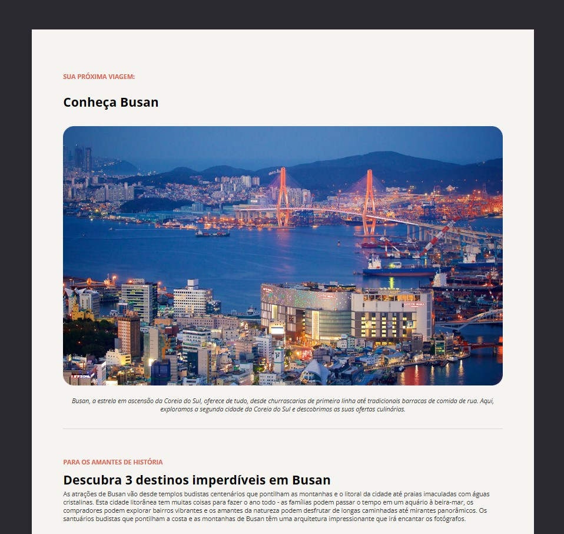

# 🌏 Local Turístico — Busan

Uma página web sobre os principais pontos turísticos de **Busan, Coreia do Sul**, desenvolvida com HTML5 e CSS3.

## 📸 Preview



## 🔗 Projeto

🌐 <strong><a href="https://lucas072-cpu.github.io/Local-Tur-stico/" target="_blank">Acesse o projeto online</a></strong>

## 📖 Sobre

O projeto apresenta informações sobre Busan e destaca três destinos turísticos da cidade:

- 🏯 Templo Haedong Yonggungsa
- ⛩️ Templo Beomeo-sa
- 🌳 Parque Yongdusan

A página foi desenvolvida com foco em uma apresentação visual organizada, utilizando imagens, textos, títulos e listas para estruturar as informações sobre cada destino.

## 🛠️ Tecnologias

- **HTML5**
- **CSS3**
- **Google Fonts**

## 🎨 Estilização

O projeto utiliza CSS para trabalhar:

- Cores de fundo e textos
- Tipografia
- Tamanhos e pesos das fontes
- Espaçamentos com `margin` e `padding`
- Bordas
- Alinhamento de textos
- Listas
- Imagens
- Organização e dimensionamento da página

## 📂 Estrutura

```text
📦 projeto
├── 📄 index.html
├── 📄 style.css
└── 📁 assets
    ├── 🖼️ image.png
    ├── 🖼️ templo1.png
    ├── 🖼️ imagem2.png
    ├── 🖼️ image3.png
    └── ❤️ Vector.png
```

## 🎯 Objetivo

Este projeto foi desenvolvido como prática de **HTML e CSS**, colocando em prática conceitos de estruturação de páginas, estilização e organização visual de conteúdo.

---

### 👨‍💻 Desenvolvido por Lucas

[](https://github.com/lucas072-cpu)
